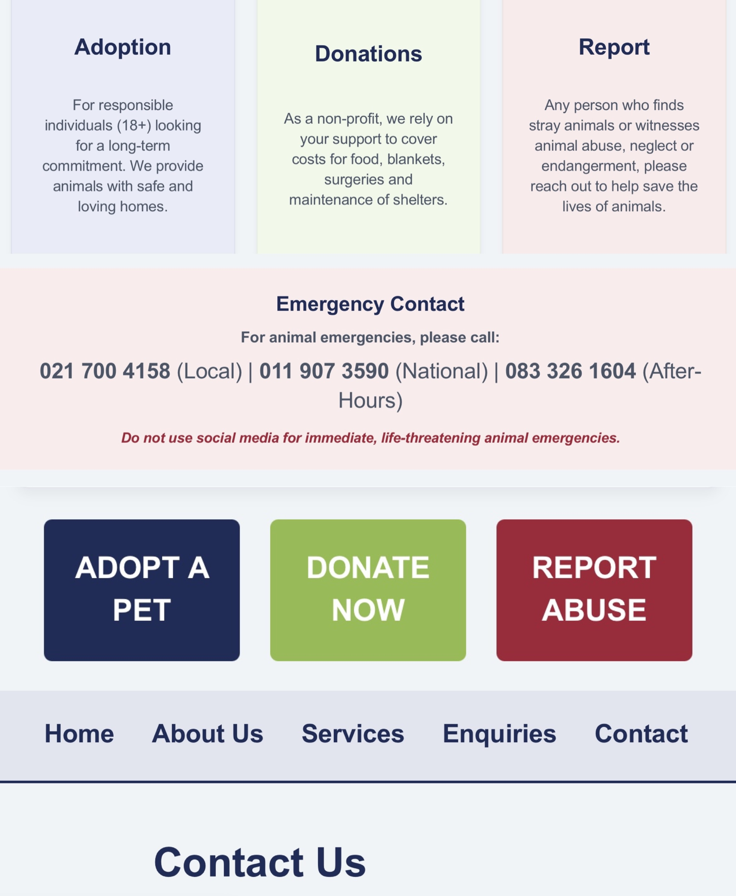
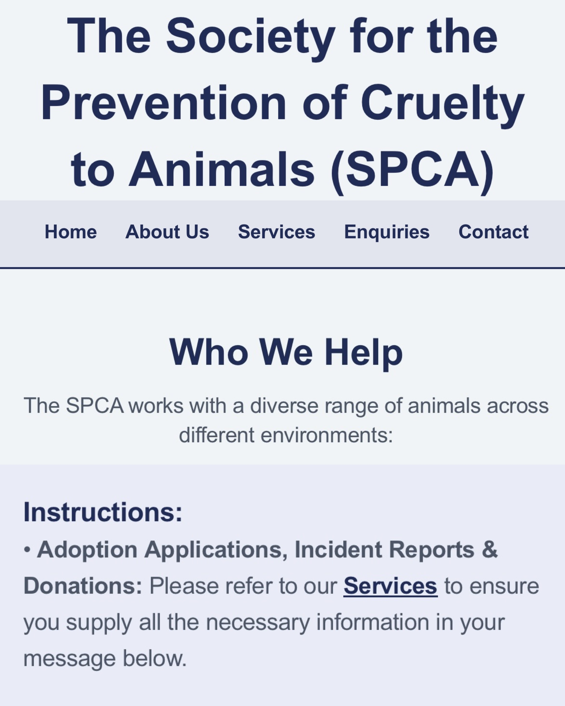
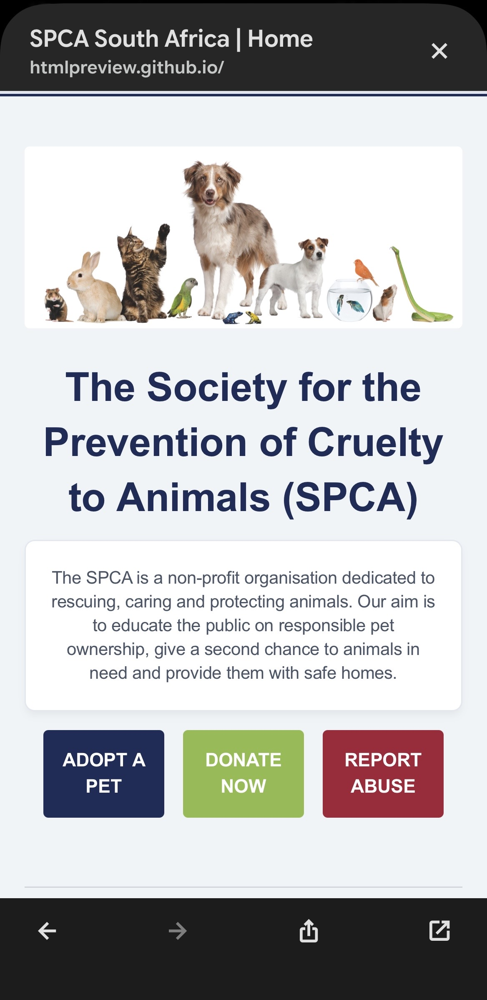
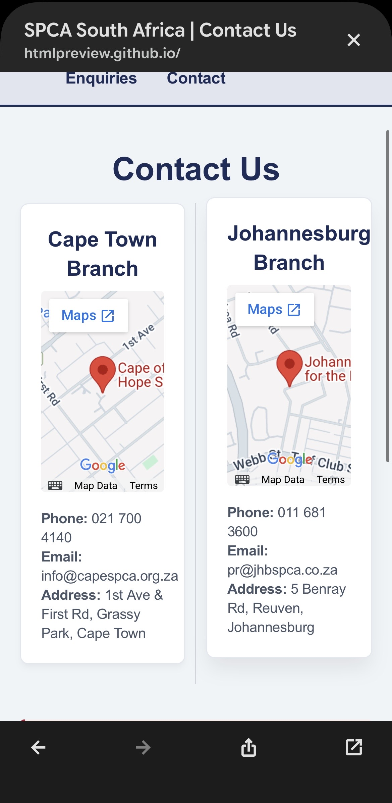
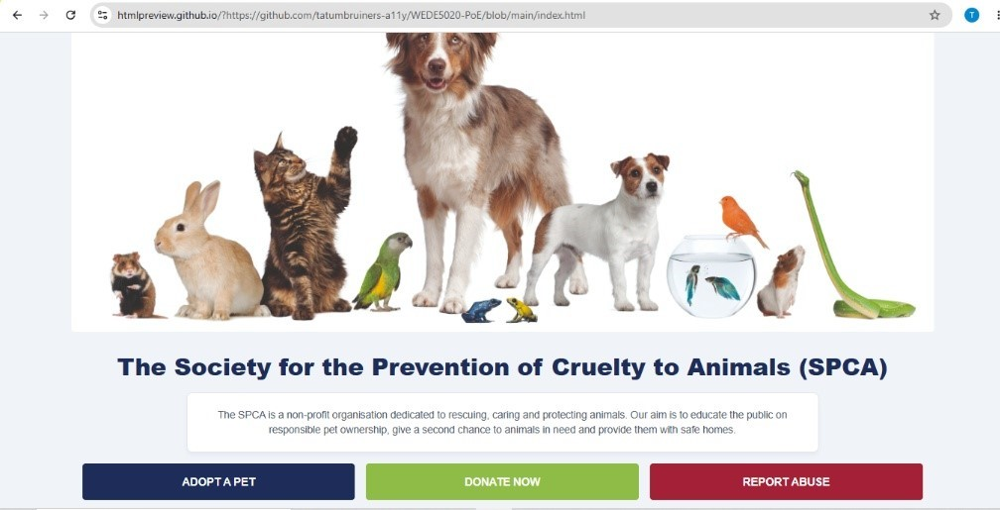
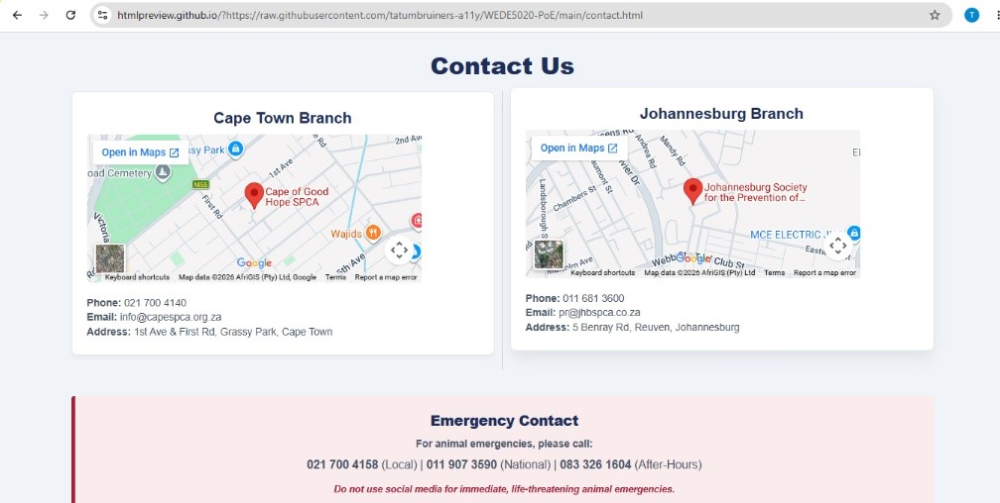
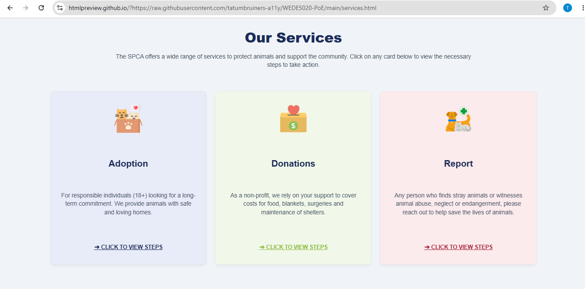
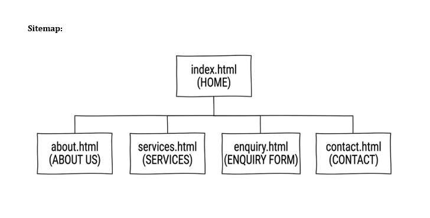
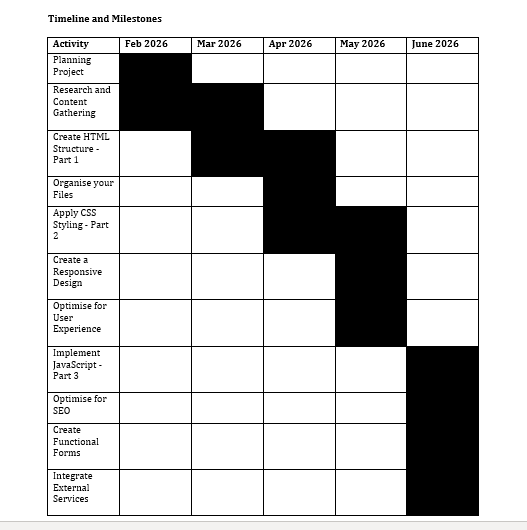

WEDE5020-PoE

Module: WEDE5020 – Web Development (Introduction)
Student Name: Tatum Bruiners
Student Number: ST10513693
Group: 1

Project Overview

This project forms part of the WEDE5020 Web Development module and focuses on the design and development of a responsive website for the Society for the Prevention of Cruelty to Animals (SPCA). The purpose of the website is to provide users with easy access to information about animal welfare, adoptions, donations and reporting animal cruelty. The project is completed in phases. Part 1 focuses on planning, research, content gathering, website structure and HTML development. Part 2 focuses on visual design through CSS styling, user experience improvements and responsive design for different screen sizes. Throughout development, GitHub is used for version control, documentation and project management. The website aims to provide a simple and user-friendly experience that encourages meaningful user actions while supporting the SPCA's mission of protecting and caring for animals.

Website Goals and Objectives

The primary goal of the website is to encourage users to support the SPCA through adoptions, donations, reporting animal cruelty, volunteering or sponsorship. The website also serves as an educational platform that promotes responsible pet ownership and animal welfare awareness. Success will be measured through user engagement, adoption enquiries, donation activity and increased accessibility of SPCA services.

Key Features and Functionality

The website consists of five main pages: Home, About Us, Services, Enquiry Form and Contact. Together these pages provide visitors with information about the SPCA, its mission, services and available ways to support animal welfare initiatives. Clear navigation is implemented across all pages to ensure users can easily find information and complete important actions. Key user actions include learning about the organisation, viewing available services, submitting enquiries, volunteering, donating and reporting animal cruelty. The website has been designed using HTML and CSS and follows responsive design principles to ensure accessibility across desktop, tablet and mobile devices. JavaScript functionality will be implemented in later phases of development. A clean layout, structured content sections and colour-coded action areas help improve usability and user experience.

Colour Palette

The website focused on soft tones of red, green, blue and grey. Red was used for reports and emergencies, green for donations, blue for adoption and grey for text. Darker shades of blue was used for headings and navigation. A light blue background was used to keep the design simple.

Typography Specifications

A simple sans-serif font stack consisting of Segoe UI and Arial was used because it is easy to read across different devices. Headings was enlarged and made bold to make them stand out, while normal text was used for content. Line height was set to 1.4 to keep text compact and readable. Different font sizes helped to separate headings from body text.

Website Pages Across Devices

Mobile

Desktop

Part 1 Features

Part 1 focused on project planning and website development foundations. This included researching organisations, selecting the SPCA as the target organisation, creating and submitting project proposals, gathering and evaluating website content, planning the website structure and sitemap and developing the initial HTML pages. During this phase, a GitHub repository was created to manage project files, version control and ongoing documentation while ensuring all submission requirements were met.

Part 2 Features

Part 2 focused on improving the visual appearance and usability of the website through CSS styling and responsive design. Feedback received from Part 1 was incorporated into the project and a consistent colour palette, typography system, navigation styling, content cards, buttons and page layouts were implemented. Responsive techniques such as media queries, flexible layouts and relative sizing were applied to ensure the website displays correctly across desktop, tablet and mobile devices. GitHub continued to be used for version control, testing updates and maintaining project documentation.

Sitemap

Timeline and Milestones

Changelog

29 April 2026 – Project Setup

- Initial project structure created with folders and base HTML files
- Added navigation across all pages
- Renamed and organised image assets
- Added consistent header and footer to all pages

30 April 2026 – Content Development

- Completed homepage, about page, services page, enquiry page and contact page content
- Embedded Google Maps on contact page
- Uploaded project proposal and research documentation
- Expanded README with sitemap and timeline

25 May 2026 – Styling Preparation & Layout Work

- Added structural div containers across pages
- Linked external CSS stylesheet to all pages
- Updated layout structure and improved page organisation

29 May 2026 – Layout Refinement & Styling Updates

- Applied multiple CSS refinements to improve structure and alignment
- Uploaded unzipped research documents

30 May 2026 – Final Styling & Content Finalisation

- Finalised homepage by updating content and incorporating CSS styling
- Finalised about page by updating content to match global CSS styles
- Finalised services page by updating content to match global CSS styles
- Finalised enquiry page by updating content to match global CSS styles
- Finalised contact page by updating content to match global CSS styles
- Finalised overall CSS styling across all project pages
- Added emergency contact information to site layout
- Expanded enquiry page with additional instructions and user guidance
- Added interactive service cards with hover/flip effects
- Updated CSS to support interactive card animations
- Refined layout structure and improved visual consistency
- Uploaded updated proposal and research documents
- Added new images to files
- Updated Changelog and ReadMe files

References

Adobe. (2025) The role of KPIs in modern web performance. Available at: https://business.adobe.com/blog/basics/kpi (Accessed: 19 April 2026).

Allanux Web. (2026) Website maintenance costs in South Africa: 2026 pricing guide. Available at: https://www.allanuxweb.com/blog/website-maintenance-costs (Accessed: 19 April 2026).

AltaVista. (2025) Why mobile-friendly websites are crucial in 2025. Available at: https://www.altavistasp.com/why-mobile-friendly-websites-are-crucial-in-2025/ (Accessed: 19 April 2026).

Cape of Good Hope SPCA. (2024) Donate. Available at: https://capespca.co.za/donate/ (Accessed: 19 April 2026).

Cape of Good Hope SPCA. (2025) Adoptions. Available at: https://capespca.co.za/adopt/ (Accessed: 19 April 2026).

Cape of Good Hope SPCA. (2025) Inspectorate Department. Available at: https://capespca.co.za/services/inspectorate-department/ (Accessed: 19 April 2026).

Cape of Good Hope SPCA. (2026) Volunteer. Available at: https://capespca.co.za/get-involved/volunteer/ (Accessed: 19 April 2026).

Cape of Good Hope SPCA. (2026) Welcome to the Cape of Good Hope SPCA. Available at: https://capespca.co.za/ (Accessed: 19 April 2026).

Cape of Good Hope SPCA. (2026) Wildlife. Available at: https://capespca.co.za/services/wildlife (Accessed: 19 April 2026).

Cloudflare. (2026) What is a domain name? Domain names vs URLs. Available at: https://www.cloudflare.com/learning/dns/glossary/what-is-a-domain-name/ (Accessed: 19 April 2026).

Devoq. (2024) The essentials of modern web design: UI/UX best practices for 2024. Available at: https://devoq.medium.com/the-essentials-of-modern-web-design-ui-ux-best-practices-for-2024-f2965e65de10 (Accessed: 19 April 2026).

FontIcon. (2026) Vector icons for navigation and service categories. Available at: https://fontawesome.com (Accessed: 20 April 2026).

HOSTAFRICA. (2024) Web hosting vs domain name: What you need to know. Available at: https://hostafrica.co.za/blog/domains/domain-basics/domain-vs-hosting/ (Accessed: 19 April 2026).

HOSTAFRICA. (2026) Domains. Available at: https://hostafrica.co.za/domains/ (Accessed: 19 April 2026).

Hostigo. (2026) Web hosting South Africa. Available at: https://hostigo.co.za/ (Accessed: 19 April 2026).

Image Color Picker. (2026) Color picker online | HEX color picker | HTML color picker. Available at: https://imagecolorpicker.com/ (Accessed: 19 April 2026).

Indeed. (2025) 15 website improvement tips. Available at: https://www.indeed.com/career-advice/career-development/improvement-of-website (Accessed: 19 April 2026).

Jelly Design Studio. (2025) 5 must-have service-based website pages to build trust and book clients. Available at: https://jellydesignstudio.com/service-based-website-page/ (Accessed: 19 April 2026).

Johannesburg SPCA. (2026) Contact us. Available at: https://jhbspca.co.za/contact-us/ (Accessed: 19 April 2026).

Kids SPCA Education. (2026) What we do. Available at: https://kids.spcaeducation.org.nz/about-spca/what-we-do/ (Accessed: 19 April 2026).

Mozilla. (2026) MDN Web Docs. Available at: https://developer.mozilla.org/en-US/ (Accessed: 19 April 2026).

Nicola. (2025) 5 essential pages every small business website needs. Available at: https://www.webador.com/blog/5-essential-pages-every-small-business-website-needs/ (Accessed: 19 April 2026).

NSPCA. (2021) SAPS guide: Animal Protection Act. Available at: https://nspca.co.za/wp-content/uploads/2021/11/SAPS-Guide.pdf (Accessed: 19 April 2026).

NSPCA. (2025) About the NSPCA. Available at: https://nspca.co.za/about-us/ (Accessed: 19 April 2026).

NSPCA. (2026) Contact the National Council of SPCAs in South Africa. Available at: https://nspca.co.za/contact/ (Accessed: 19 April 2026).

NSPCA. (2026) Our history and the fight against cruelty. Available at: https://nspca.co.za/ (Accessed: 19 April 2026).

ProCompare. (n.d.) How much does website development cost? Available at: https://www.procompare.co.za/prices/web-design/website-development (Accessed: 19 April 2026).

SPCA Digital. (2021) How can I help? Emergency response information. Available at: https://capespca.co.za/wildlife-news/how-can-i-help-emergency-response-information/ (Accessed: 19 April 2026).

SPCA International. (2025) Our history. Available at: https://www.spcai.org/about (Accessed: 19 April 2026).

SPCA International. (2025) Pet rescue, animal shelters, adopt a pet. Available at: https://www.spcai.org/ (Accessed: 19 April 2026).

SPCA International. (2026) Mission, vision & values. Available at: https://www.spcai.org/about/mission-vision-values (Accessed: 19 April 2026).

SPCA Vereeniging & Vanderbijlpark. (2025) Home. Available at: https://spca-ver.co.za/ (Accessed: 19 April 2026).

Unsplash. (2026) Stock photography for animal welfare and staff profiles. Available at: https://unsplash.com (Accessed: 20 April 2026).

Web.MIT. (n.d.) Safe web fonts. Available at: https://web.mit.edu/jmorzins/www/fonts.html (Accessed: 19 April 2026).

Wikipedia Contributors. (2026) Society for the Prevention of Cruelty to Animals. Available at: https://en.wikipedia.org/wiki/Society_for_the_Prevention_of_Cruelty_to_Animals (Accessed: 19 April 2026).

Sumbission Summary

This submission includes:

- Website Project Proposals
- Content Research and Sourcing
- Project overview
- Website goals and objectives
- Key functions and functionality
- Colour palette
- Typography specifications
- Website pages across devices
- Part 1 and Part 2 features
- Sitemap
- Timeline and milestones
- Changelog and development history
- Source code for all pages
- Full reference list used throughout the project

Further development (JavaScript functionality) will be implemented in Part 3.